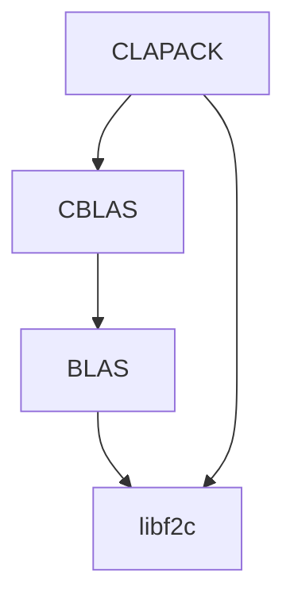

# README

## Overview

This repo contains a tested version of CBLAS with BLAS, both entirely written
in C. Having all soure code in C allows to easily convert the library to WASM.

CLAPACK is also included but no tests were run.

For install instructions, please refer to [INSTALL](./INSTALL.md).

This repository contains

```bash
.
├── CBLAS_README
├── CLAPACK/
├── examples
├── f2c_BLAS-3.8.0/
├── include/
├── libf2c/
├── src/
└── testing/
```

* `CBLAS_README` is the README originally found in CBLAS.
* `CLAPACK` contains the CLAPACK source code with redundancies (e.g. BLAS)
  removed.
* `examples`, `include`, `src` and `testing` are the directories with the same
  name found in CBLAS.
* `f2c_BLAS-3.8.0` contains the source code of BLAS-3.8.0 converted to C using the
  `f2c` program. For more information about this conversion, please this
  [section](#automatic-fortran-77-to-c-translation).
* `libf2c` contains functions and structure definition required by `f2c` converted
  programs to run.

The dependencies look as follows:



Changes made to these various directories are all listed in a `changelog.txt`
file put in these directories.

For a summary of what changed in these components, please read below.

## Automatic FORTRAN 77 to C translation

### f2c

[`f2c`](https://www.netlib.org/f2c/) is a tool that converts FORTRAN to C code.
To account for the fact that FORTRAN `real` type is equivalent to C `float`
type, the `-R` flags has been systematically used.

The version of the program, which is not provided as it is not necessary is
`20191129`.

### libf2c

Any code translated using the program `f2c` needs to be link against the
`libf2c.a`library. This library can be created using the files in the directory
`libf2c/`, which is provided in this repo.

Note that the header file `f2c.h` in `libf2c` has been modified to account for
the fact that `int`s in modern C compilers are 4 bytes long. In short, the
following command has been run:

```bash
sed -i 's/long int /int /g' f2c.h
```

For the complete list of changes made to libf2c, please refer to
[./libf2c/changelog.txt](./libf2c/changelog.txt).

### Automated translation of BLAS from FORTRAN to C

BLAS, which is originally written in FORTRAN, has been tranlated to C using the
program [`f2c`](https://www.netlib.org/f2c/) using the command

```bash
mkdir f2c_BLAS-3.8.0
f2c -d f2c_BLAS-3.8.0 -aR *.c
```

in the BLAS (version 3.8.0) directory.

This produces C files in the directory `f2c_BLAS-3.8.0/`. Note that the files
`xerbla.f` and `xerbla_array.f` cannot be translated to C with `f2c` as they
contain non FORTRAN 77 instructions. For these two files, the C source code has
been taken from [`CLAPACK-3.2.1`](https://www.netlib.org/clapack/).

All other changes (mostly function signature changes) are listed in
[f2c_BLAS-3.8.0/changelog.txt](f2c_BLAS-3.8.0/changelog.txt).

## CBLAS

### CBLAS changes

The original source code of CBLAS contains the following BLAS wrappers written
in FORTRAN:

```bash
cdotcsub.f
cdotusub.f
dasumsub.f
ddotsub.f
dnrm2sub.f
dsdotsub.f
dzasumsub.f
dznrm2sub.f
icamaxsub.f
idamaxsub.f
isamaxsub.f
izamaxsub.f
sasumsub.f
scasumsub.f
scnrm2sub.f
sdotsub.f
sdsdotsub.f
snrm2sub.f
zdotcsub.f
zdotusub.f
```

As these were simple wrappers, their usage in the C code has been replaced
by direct calls to the BLAS subroutines (provided by the BLAS library). The
modifications had to make the following assumptions:

* BLAS to C type equivalence
  * `REAL` -> `float`
  * `DOUBLEREAL` -> `double`
  * `INTEGER` -> `int`
  * `VOID` -> `void`
* `f2c` converted function interface
  * The subroutines `cdotc`, `cdotu`, `zdotc`, and `zdotu` return no value but
    store the result in a pointer given as a subroutine parameter
* Complex types
  * The then missing C types `complex` and `doublecomplex` have been defined
    in `include/cblas_f77.h`

With these modifications, the FORTRAN free code of CBLAS passes all the
(unmodified) tests in the `testing` directory.

For the complete list of changes, please refer to [changelog.txt](changelog.txt)

### CBLAS test suite

To allow automated testing of the generated CBLAS library in wasm, the test
suites has also been converted to c using `f2c`. To ensure that the converted
tests are correct, the following procedure has been followed:

1. Convert BLAS to C and CBLAS to C **without modifying the test source code**
2. Once CBLAS passes all the original tests, convert the test source code
  **without modifying the CBLAS or BLAS C code**.
3. Check that all the tests (now written in C) pass with the BLAS and CBLAS
  code (written in C too)

## CLAPACK

Usage of the following functions had to be changed:
* `xerbla_` (return value type)
* `lsame_` (return value and argument list)
* `s_copy` (return value type)
* `s_cat` (return value type)

For the complete list of changes, please refer to
[CLAPACK/changelog.txt](CLAPACK/changelog.txt)

For more information about CLAPACK and LAPACK, please refer to

```
Anderson, E.; Bai, Z.; Bischof, C.; Blackford, S.; Demmel, J.; Dongarra, J.;
Du Croz, J.; Greenbaum, A.; Hammarling, S.; McKenney, A. & Sorensen, D.
LAPACK Users' Guide
Society for Industrial and Applied Mathematics, 1999
```

## Linking against CLAPACK

To use the various libraries, assuming that the variable `CLAPACKROOT` contains
the path to the root of this directory, link as follows:

```
$(CLAPACKROOT)/CLAPACK/lapack.a $(CLAPACKROOT)/CLAPACK/libcblaswr.a \
$(CLAPACKROOT)/lib/cblas.a \
$(CLAPACKROOT)/f2c_BLAS-3.8.0/blas.a $(CLAPACKROOT)/libf2c/libf2c.a
```
